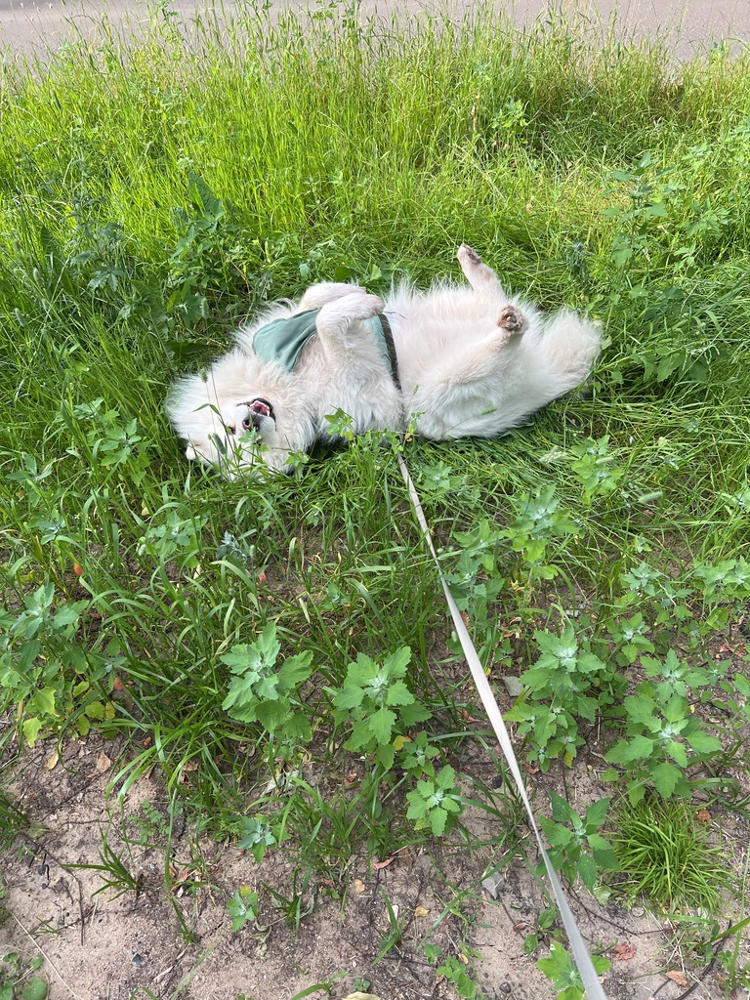

# Задача №3: Публикация проекта на GitHub Pages

## Немного о себе
Здравствуйте, дорогая Алёна!

Мне 26 лет и я решила стать **Fullstack** разработчиком.

Коллеги с прошлой работы сказали мне: 
>ты ~~не справишься~~ на новом пути, у тебя ~~ничего не получится~~

Такие дела :)
Как же я не справлюсь?
Ведь у меня есть такие качества, как:

  - [+] Любовь к сложным задачам
  - [+] Усидчивость
  - [+] И самое главное - желание и вера в себя!

А еще у мня есть мой любимый белый друг, зовут Алмаз

Вот его прекрасная фотокарточка! 

Хочу поблагодарить всю команду Нетологии за Ваш труд и наши знания! :kiss:

